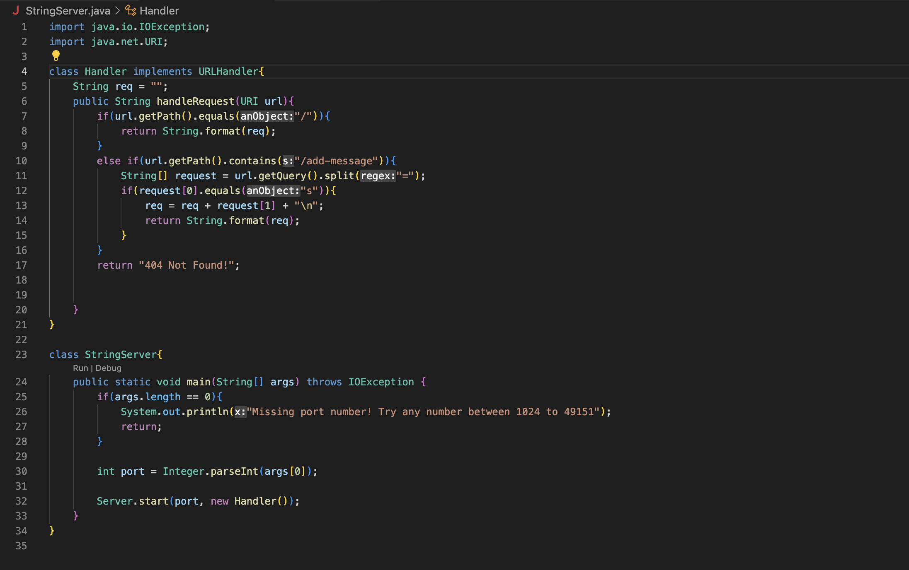
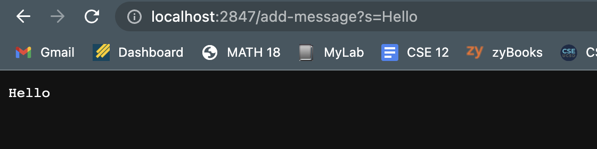
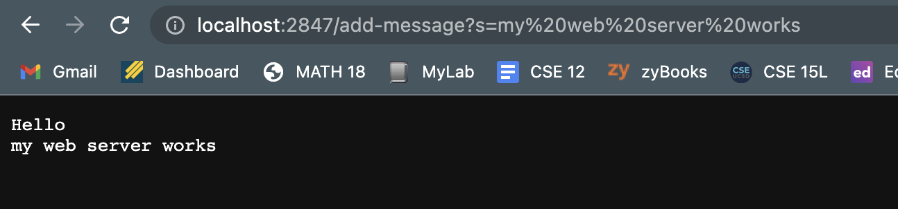
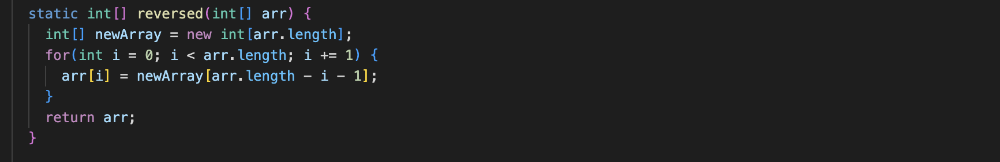
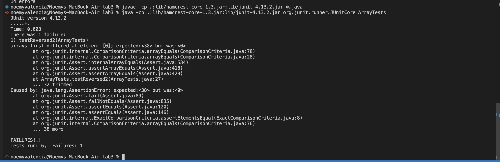

# Lab Report 2 - Servers and Bugs
---

## Part 1:
After writing my web server called StringServer, my code looks like this:


The next two examples are adding the strings Hello and my web server works, to my server.

1. 
* When I create my server, Server.java and StringServer are called, then when I add /add-message?s=Hello, my Handler class is called.
* The most important arguments for these methods are the number to create the server and /add-message?s=<String>.
* The value that changes is the URI whenever we add a string. And it changes to the last string every time we add something.

2. 
* Since the server is already created, my Handler class in my StringServer file is called to update the string showing on the server.
* The relevant argument in this step is the /add-message?s=<String> added to the URL, since it's what's going to be shown.
* The URI changes once again to the last added string, so http://localhost:2847/add-message?s=my%20web%20server%20works.
---

## Part 2:

The next picture shows a code with bugs.

* 

1. A failure inducing test for the method would be:
```
@Test
public void testReversed2(){
  int[] in2 = {3, 0, 100, 25, 38};
  assertArrayEquals(new int[]{38, 25, 100, 0, 3}, ArrayExamples.reversed(in2));
}
```

2. A test for the method that wouldn't cause failure would be:
```
@Test
public void testReversed3(){
  int[] in3 = {0, 0, 0, 0};
  assertArrayEquals(new int[]{0, 0, 0, 0}, ArrayExamples.reversed(in3));
}
```

3. The output of both test look like the following:


4. To fix the bug, here's the before and after:

* Before
```
static int[] reversed(int[] arr){
  int[] newArray = new int[arr.length];
  for(int i = 0; i < arr.length; i += 1){
    arr[i] = newArray[arr.length - i - 1];
  }
  return arr;
}
```

* After
```
static int[] reversed(int[] arr){
  int[] newArray = new int[arr.length];
  for(int i = o; i < arr.length; i += 1){
    newArray[i] = arr[arr.length - i - 1];
  }
  return newArray;
}
```

The reasoning behind this fix is that the old code updated the old list with objects from newArray and returning arr, when it should have been updating the new array and returning newArray.
---

## Part 3:
Something that I had never seen before lab 2 and 3 was web servers. And although I still don't know how to completely create a web server on my own from scratch, I know how to create one with the tools from lab.
I also really like debugging, even though I've done it several times before, it's something I really enjoy doing.
